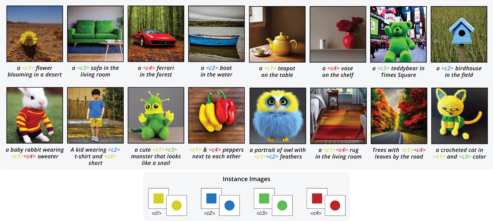

### ColorPeel: Color Prompt Learning with Diffusion Models via  Color and Shape Disentanglement [ECCV 2024]
[Muhammad Atif Butt](https://scholar.google.com/citations?user=vf7PeaoAAAAJ&hl=en), [Kai Wang](https://scholar.google.com/citations?user=j14vd0wAAAAJ&hl=en), [Javier Vazquez-Corral](https://scholar.google.com/citations?user=gjnuPMoAAAAJ&hl=en), and [Joost van de Weijer](https://scholar.google.com/citations?user=Gsw2iUEAAAAJ&hl=en)

